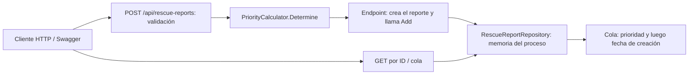
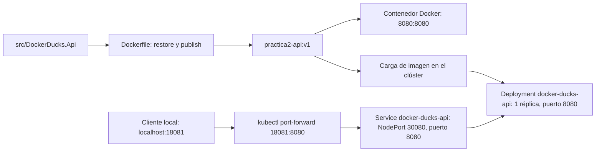

# Docker Ducks — API de rescates de fauna silvestre

## Integrantes

| Nombre completo | Usuario GitHub |
|---|---|
| Juan David Velasquez Murillo | `Juandavm12` |
| Alejandra Madrid Calderon | `alejamc14` |
| Sara Regino Ferraro | `ArsaOniSaturn` |
| Jose David Vasquez | `jvas04` |
| Paula Andrea Calderon Quintero | `paucq` |

## Descripción y objetivo

API REST en ASP.NET Core (.NET 8) para registrar reportes de rescate de fauna silvestre y organizar su atención según prioridad: `Critical`, `High` o `Medium`. La práctica demuestra la construcción de una imagen Docker y su ejecución en Kubernetes, con verificación funcional y de salud.

Podés seguir las rutas de ejecución local, Docker o Kubernetes de este documento. Los resultados capturados están en el [informe de evidencias](docs/evidencias/README.md); el video, el PDF y otros pendientes de entrega se detallan al final.

## Arquitectura

La API usa Minimal APIs. El endpoint de creación valida la solicitud, calcula la prioridad y guarda el reporte en un repositorio singleton en memoria. Las consultas usan ese mismo repositorio; no hay base de datos ni servicios externos.



El [Dockerfile](Dockerfile) compila con el SDK de .NET 8 y ejecuta la API con la imagen de ASP.NET 8, como usuario no root, en el puerto `8080`. Los [manifiestos](k8s/deployment.yaml) declaran una sola réplica, recursos de CPU/memoria y probes de readiness/liveness sobre `/health`.



El Deployment y el Service pertenecen al namespace `practica2`. El NodePort `30080` depende de la red del entorno; la ruta local demostrada es `port-forward`. No se configura Ingress ni se afirma un despliegue en la nube.

## Estructura del repositorio

```text
DockerDucks.sln                    Solución .NET
src/DockerDucks.Api/               API y reglas de rescate
  Program.cs                      Endpoints, validación y Swagger
  RescueReports/                  Modelo, calculadora y repositorio
tests/DockerDucks.Api.Tests/       Pruebas de reglas e integración
Dockerfile                        Construcción multietapa
k8s/                              Namespace, Deployment y Service
docs/evidencias/                   Informe ilustrado y capturas
```

## Requisitos

| Ruta | Herramientas |
|---|---|
| Local y pruebas | SDK de .NET 8 |
| Docker | Docker en ejecución; acceso a las imágenes base durante la construcción |
| Kubernetes | Clúster disponible, `kubectl` con el contexto correcto e imagen cargada en ese entorno |

El entorno documentado usa Docker Desktop con Kubernetes basado en kind de un solo nodo. La importación indicada abajo es específica de ese entorno. Ejecutá los comandos desde la raíz del repositorio; las tuberías mostradas usan una terminal compatible con Bash.

## Ejecución local

Restaurá dependencias y ejecutá las pruebas **antes** de iniciar el servidor:

```bash
dotnet restore DockerDucks.sln
dotnet test DockerDucks.sln --no-restore
```

Después, iniciá la API:

```bash
dotnet run --project src/DockerDucks.Api --urls http://localhost:8080
```

Este comando mantiene ocupada la terminal; detenelo con `Ctrl+C`. Mientras esté activo, abrí [Swagger local](http://localhost:8080/swagger) o [salud local](http://localhost:8080/health). Para ejecutar comandos adicionales, usá otra terminal.

## Ejecución con Docker

**El puerto local `8080` no puede estar ocupado por la ejecución .NET y el contenedor a la vez.** Detené la API local antes de publicar ese puerto con Docker.

```bash
docker build -t practica2-api:v1 .
docker images practica2-api:v1
docker run -d -p 8080:8080 --name practica2-api practica2-api:v1
docker ps --filter "name=practica2-api"
```

Accedé a `http://localhost:8080/swagger` y `http://localhost:8080/health`. El nombre `practica2-api` debe estar disponible; si ya existe un contenedor de una ejecución anterior, revisá su estado antes de repetir `docker run`. Para detenerlo sin eliminarlo:

```bash
docker stop practica2-api
```

## Ejecución en Kubernetes

### 1. Cargar la imagen correcta

Construí `practica2-api:v1` con el comando Docker anterior. En el **Docker Desktop con kind de un solo nodo observado**, Docker y Kubernetes usan almacenes separados: que `docker images` muestre la imagen no significa que containerd tenga esa versión. La importación local verificada, antes del despliegue, es:

```bash
docker save practica2-api:v1 | docker exec -i desktop-control-plane ctr -n k8s.io images import -
```

Este comando requiere que el nodo sea el contenedor `desktop-control-plane`; no es una receta universal ni una publicación en la nube. En otros clústeres, cargá la imagen correspondiente mediante el mecanismo de tu entorno o un registro compatible con la referencia del Deployment.

### 2. Aplicar los recursos y comprobar el estado

Creá primero el namespace y luego los recursos que lo usan:

```bash
kubectl apply -f k8s/namespace.yaml
kubectl apply -f k8s/deployment.yaml
kubectl apply -f k8s/service.yaml
kubectl rollout status deployment/docker-ducks-api -n practica2
kubectl get pods -n practica2
kubectl get services -n practica2
```

El Deployment usa `practica2-api:v1` con `imagePullPolicy: IfNotPresent`. **Si reconstruís la misma etiqueta `v1`, volvé a importar la imagen y reiniciá el rollout** para que los pods usen la versión actualizada en el entorno observado:

```bash
docker save practica2-api:v1 | docker exec -i desktop-control-plane ctr -n k8s.io images import -
kubectl rollout restart deployment/docker-ducks-api -n practica2
kubectl rollout status deployment/docker-ducks-api -n practica2
```

### 3. Acceder a la API

Mantené abierto este comando en otra terminal:

```bash
kubectl port-forward -n practica2 service/docker-ducks-api 18081:8080
```

Abrí [Swagger en Kubernetes](http://localhost:18081/swagger) o [salud en Kubernetes](http://localhost:18081/health). El puerto local `18081` evita competir con Docker en `8080`. El Service también declara NodePort `30080`, pero su acceso directo no estuvo disponible en el entorno de captura.

## Pruebas y contrato de la API

Las pruebas en `tests/DockerDucks.Api.Tests/` cubren reglas de prioridad, creación y consulta, ID desconocido, campos inválidos, orden de la cola, salud y disponibilidad de OpenAPI. Se ejecutan con `dotnet test DockerDucks.sln --no-restore` después de restaurar; no requieren iniciar manualmente la API.

| Método | Ruta | Comportamiento |
|---|---|---|
| `POST` | `/api/rescue-reports` | Crea un reporte: `201 Created` y cabecera `Location`; validación inválida: `400`. |
| `GET` | `/api/rescue-reports/queue` | Devuelve la cola ordenada: `200`. |
| `GET` | `/api/rescue-reports/{id:guid}` | Consulta por GUID: `200` o `404` si no existe. |
| `GET` | `/health` | Comprobación de salud. |
| `GET` | `/swagger` | Interfaz de documentación y prueba. |
| `GET` | `/swagger/v1/swagger.json` | Documento OpenAPI. |

Ejemplo de solicitud para `POST /api/rescue-reports`:

```json
{
  "animalDescription": "Zarigüeya adulta",
  "municipalitySector": "Parque del barrio",
  "situationDescription": "Presenta una lesión en una pata",
  "condition": "Injured",
  "immediateDanger": false,
  "quantity": 1
}
```

La respuesta contiene esos datos más `id`, `priority` y `createdAt` (fecha UTC); en este caso, `priority` es `High`. Los tres textos deben contener caracteres no blancos, `condition` debe estar presente y `quantity` debe ser mayor que cero. Las condiciones del dominio son `Stable`, `Injured` y `Critical`; los enums se serializan como texto.

| Regla | Prioridad |
|---|---|
| `condition` es `Critical` o `immediateDanger` es `true` | `Critical` |
| `condition` es `Injured`, sin peligro inmediato | `High` |
| `condition` es `Stable`, sin peligro inmediato | `Medium` |

La cola ordena primero por `Critical`, `High`, `Medium` y después por fecha de creación más antigua dentro de cada prioridad.

## Evidencias

El [informe de evidencias](docs/evidencias/README.md) reúne capturas de imagen y contenedor Docker, solicitud y respuesta desde Swagger, pod y Service de Kubernetes, salud por `port-forward` y extractos de los manifiestos. También explica los problemas encontrados y su resolución. Es la base factual para preparar el PDF, no una afirmación de que el PDF ya esté entregado.

## Limitaciones y pendientes

- **Persistencia:** los reportes viven solo en memoria; se pierden al reiniciar la API, el contenedor o el pod. No se comparten entre procesos; los manifiestos declaran una sola réplica.
- **Swagger:** la evidencia registra `200` en los metadatos del POST y `201` en ejecución. Esa discrepancia documental sigue siendo una limitación conocida. Swashbuckle `7.3.0` resolvió el problema de renderizado de OpenAPI `3.0.4` descrito en el informe.
- **Alcance de las capturas:** los estados e IDs corresponden al momento registrado; no garantizan disponibilidad actual ni acceso externo permanente.
- **Video:** pendiente de publicación; no hay enlace de entrega confirmado.
- **PDF:** pendiente de preparación y verificación de accesibilidad antes del envío por Teams.
- **Responsabilidades:** pendiente documentar el reparto de tareas por integrante.
- **Colaborador:** pendiente agregar o confirmar el acceso de `oalarconpe` al repositorio.
