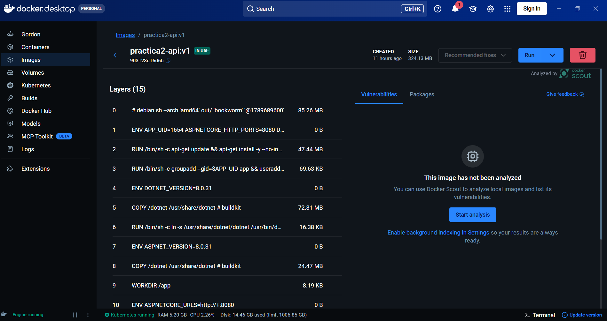
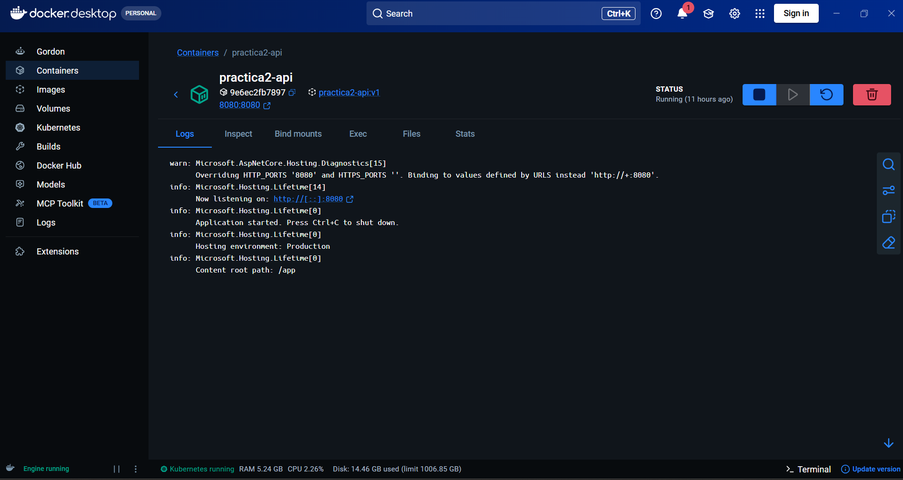
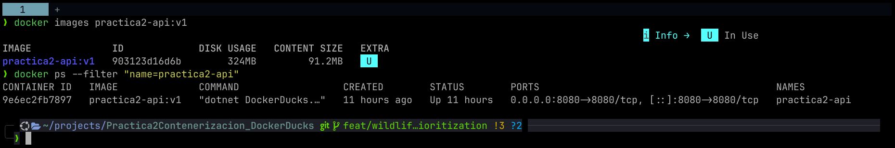
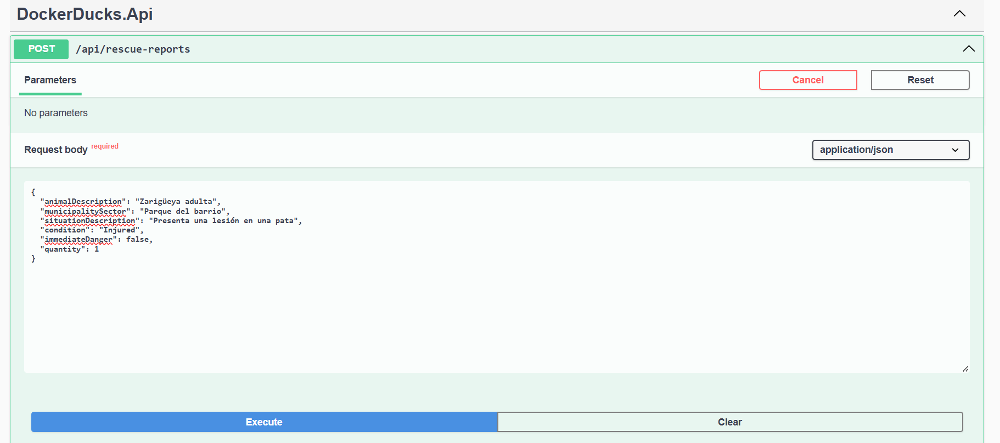
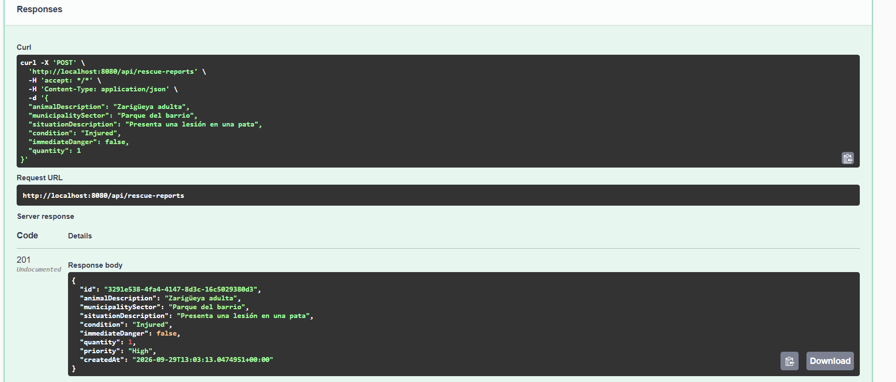
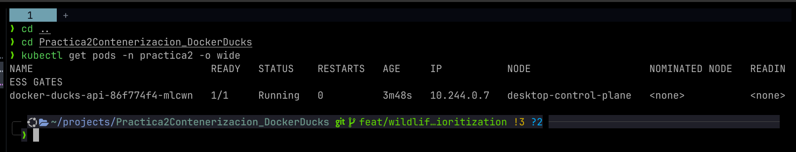
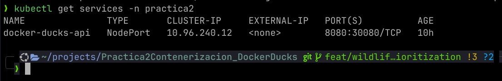
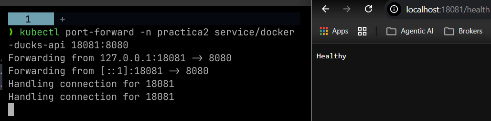
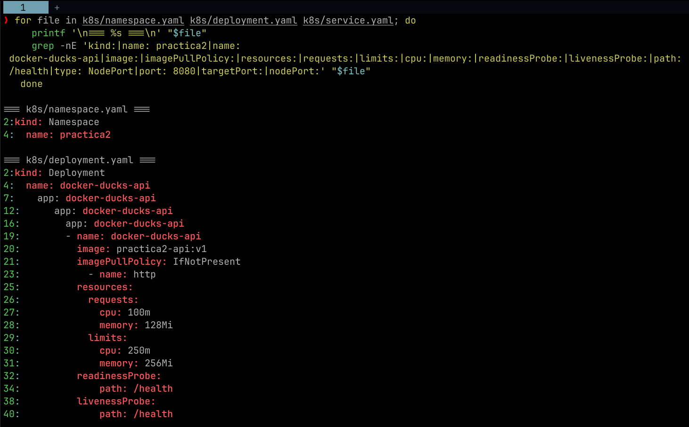
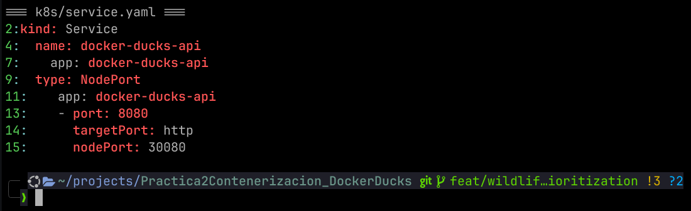

# Informe de evidencias: Docker y Kubernetes

Este informe documenta las evidencias capturadas para Docker Ducks y es la base factual para el PDF final. Describe observaciones realizadas al momento de cada captura; no garantiza que los recursos, puertos ni resultados permanezcan disponibles después.

## Objetivo y alcance

Se verificó la ejecución de la API de rescates en un contenedor Docker y en Kubernetes. La evidencia cubre la imagen y el contenedor locales, una operación `POST` realizada desde Swagger, el estado del despliegue y del Service, el acceso de salud mediante `port-forward` y la configuración declarada en los manifiestos.

| Elemento | Observación registrada |
|---|---|
| Imagen Docker | `practica2-api:v1`, ID final `903123d16d6b` |
| Contenedor Docker | `practica2-api`, ID `9e6ec2fb7897`, puerto publicado `8080:8080` |
| Namespace de Kubernetes | `practica2` |
| API y Service | Puerto `8080`; Service `docker-ducks-api` de tipo NodePort `8080:30080` |
| Ruta de salud demostrada | `port-forward` local `18081` hacia el Service en `8080` |

## Resultados en Docker

Las capturas muestran que la imagen local y el contenedor asociado estaban disponibles y en ejecución al momento del registro. La evidencia terminal confirma la correspondencia entre la etiqueta, el ID de imagen, el ID del contenedor y la publicación del puerto.

*Figura 1. Docker Desktop muestra la imagen `practica2-api:v1` en uso, con ID final `903123d16d6b`.*

*Figura 2. Docker Desktop registra el contenedor `practica2-api` en estado `Running`, con ID `9e6ec2fb7897` y mapeo `8080:8080`.*

*Figura 3. La terminal confirma la imagen `practica2-api:v1` con ID `903123d16d6b` y el contenedor `9e6ec2fb7897` activo, exponiendo el puerto `8080`.*

## Resultado funcional de la API

Se ejecutó `POST /api/rescue-reports` desde Swagger contra la API servida en el puerto `8080`. La solicitud contiene un reporte de zarigüeya en condición `Injured`; la respuesta observada fue `201` y devolvió prioridad `High`, coherente con el dato enviado.

### Solicitud y respuesta en Swagger

*Figura 4. Primera parte de la evidencia Swagger: cuerpo de la solicitud para `POST /api/rescue-reports`.*

*Figura 5. Segunda parte de la evidencia Swagger: respuesta HTTP `201` y reporte creado con prioridad `High`.*

> **Limitación de metadatos:** Swagger documentaba la operación `POST` con respuesta `200`, mientras que la ejecución registrada devolvió correctamente `201`. Es una discrepancia de documentación OpenAPI, no un fallo de ejecución observado.

## Resultados en Kubernetes

Al momento de la captura, el pod de `docker-ducks-api` en el namespace `practica2` estaba `Running`, listo `1/1` y con cero reinicios. El Service asociado estaba declarado como NodePort, con el puerto de servicio `8080` y el NodePort `30080`.

*Figura 6. `kubectl get pods -n practica2 -o wide` muestra el pod `docker-ducks-api` en `Running`, `1/1` y con `0` reinicios al momento de la captura.*

*Figura 7. `kubectl get services -n practica2` registra el Service `docker-ducks-api` como NodePort `8080:30080`.*

### Acceso de salud demostrado

El acceso directo por NodePort no estuvo disponible en el entorno de captura. En su lugar, se demostró la salud de la API mediante el reenvío local `18081:8080` hacia el Service; la respuesta visualizada fue `Healthy`.

*Figura 8. El `port-forward` desde `18081` al puerto `8080` del Service está activo y la ruta de salud responde `Healthy`.*

## Configuración declarada en los manifiestos

Los extractos de YAML respaldan la configuración observada: namespace `practica2`, imagen `practica2-api:v1`, política `IfNotPresent`, recursos de CPU y memoria, probes de readiness y liveness sobre `/health`, y Service NodePort para `8080:30080`.

### Namespace, Deployment y probes

*Figura 9. Primera parte de los manifiestos: namespace `practica2`, Deployment con imagen `practica2-api:v1`, `imagePullPolicy: IfNotPresent`, requests/limits y probes sobre `/health`.*

### Service NodePort

*Figura 10. Segunda parte de los manifiestos: Service `docker-ducks-api` de tipo NodePort, con puerto `8080` y `nodePort` `30080`.*

## Problemas encontrados y resolución

| Situación | Hecho registrado | Resolución o alcance |
|---|---|---|
| Interfaz Swagger | Swashbuckle `6.6.2` rechazó una especificación OpenAPI `3.0.4` válida. | Se actualizó a `7.3.0` y se verificó que la interfaz renderizara la operación capturada. |
| Imagen en Kubernetes | Docker Desktop con kind reutilizaba una etiqueta local anterior desde su almacén separado `k8s.io` de containerd. | Se importó la imagen reconstruida y se realizó el rollout del despliegue. |
| Acceso por NodePort | El acceso directo al NodePort no estuvo disponible en el entorno de captura. | Se documentó y verificó el acceso mediante `port-forward` en el puerto local `18081`. |
| Respuesta declarada por Swagger | La documentación Swagger mostraba `200` para el `POST`, pero la respuesta real fue `201`. | Se mantiene como limitación de metadatos divulgada; no se observó un fallo de la API. |

## Limitaciones de la evidencia

- Los estados `Running`, `1/1`, cero reinicios, los IDs y la disponibilidad de puertos corresponden al instante de las capturas.
- El NodePort `30080` está declarado en el Service, pero su accesibilidad directa depende de la red y del entorno local.
- La evidencia funcional de Kubernetes prueba la ruta de salud por `port-forward`; no prueba acceso externo permanente por NodePort.
